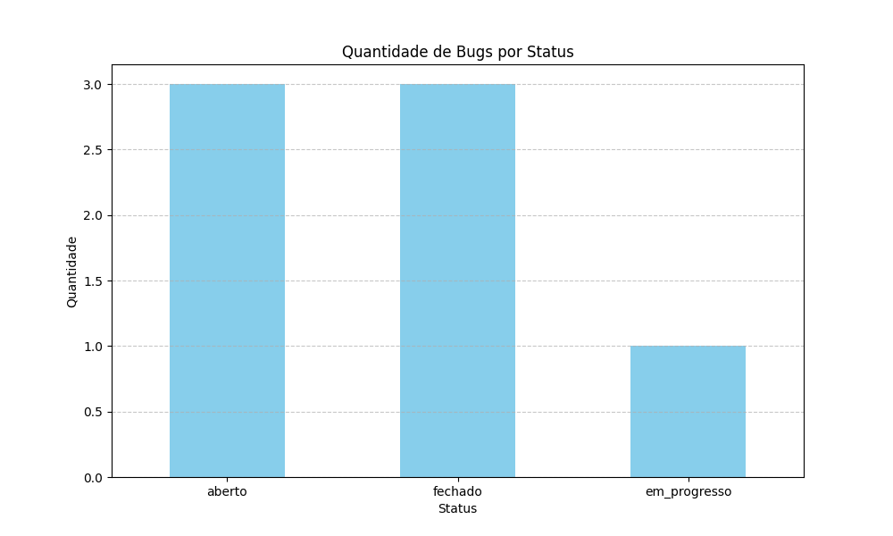
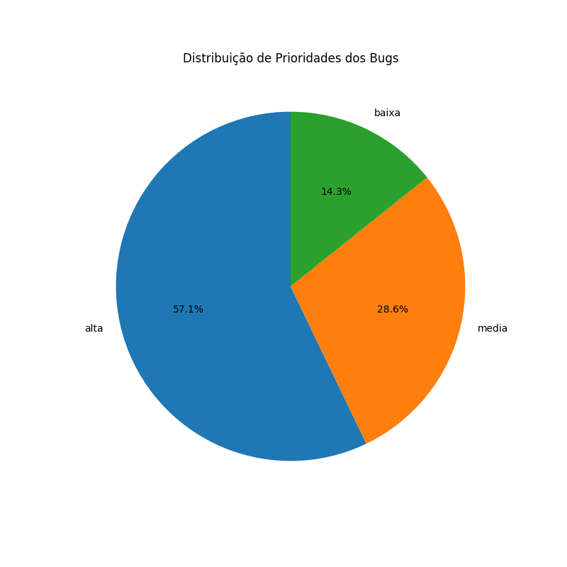

# Dashboard de Análise de Bugs



## 📌 Sobre o Projeto

Este projeto é um script em Python que lê um arquivo de dados `bugs.json`, realiza uma análise utilizando a biblioteca Pandas e gera relatórios e gráficos sobre o status dos bugs reportados. É um exemplo prático de como automatizar a criação de um dashboard simples a partir de dados em formato JSON.

### ✨ Principais Funcionalidades

- Lê dados de um arquivo `.json`.
- Filtra e analisa os dados com **Pandas**.
- Calcula a quantidade de bugs por status (`aberto`, `fechado`, etc.).
- Calcula o percentual de bugs com prioridade alta.
- Calcula o tempo médio para a resolução de um bug.
- Gera visualizações gráficas (barras e pizza) com **Matplotlib**.

### 🛠️ Tecnologias Utilizadas

- **Python 3**
- **Pandas** - Para manipulação e análise de dados.
- **Matplotlib** - Para a criação dos gráficos.
- **venv** - Para gerenciamento do ambiente virtual.

---

## 🚀 Como Executar o Projeto

Siga os passos abaixo para executar o projeto localmente.

### Pré-requisitos

Antes de começar, você vai precisar ter o [Git](https://git-scm.com) e o [Python 3](https://www.python.org/) instalados em sua máquina.

### Passo a Passo

1.  **Clone o repositório:**

    ```bash
    git clone [https://github.com/SEU-USUARIO/python-bug-dashboard.git](https://github.com/Rychardsson/python-bug-dashboard.git)
    ```

2.  **Acesse a pasta do projeto:**

    ```bash
    cd python-bug-dashboard
    ```

3.  **Crie e ative o ambiente virtual:**

    ```bash
    # Cria o ambiente
    python -m venv venv

    # Ativa o ambiente (Windows)
    .\venv\Scripts\activate

    # Ativa o ambiente (macOS/Linux)
    source venv/bin/activate
    ```

4.  **Instale as dependências:**

    ```bash
    pip install -r requirements.txt
    ```

5.  **Execute o script:**
    ```bash
    python dashboard.py
    ```

### 📊 Saída Esperada

Após a execução, você verá os relatórios impressos no terminal e dois novos arquivos de imagem serão gerados na pasta do projeto:

- `bugs_por_status.png` (gráfico de barras)
- `distribuicao_prioridades.png` (gráfico de pizza)



---

## 📄 Licença

Este projeto está sob a licença MIT. Veja o arquivo [LICENSE](LICENSE.md) para mais detalhes.
